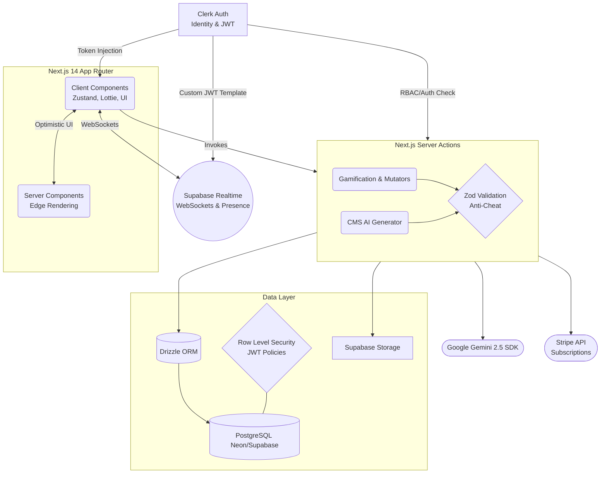
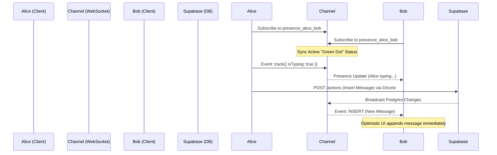

# Visão Geral da Arquitetura Enterprise

Este documento mapeia o ecossistema holístico da plataforma **MyDuolingo**, desconstruindo a intersecção simbiótica entre React, APIs Generativas, WebSockets e as trincheiras blindadas da Data Layer.

---

## 1. Topologia Macro (Flowchart do Ecossistema)

A arquitetura reflete um padrão Serverless imaculado focado numa clara segregação Client vs Server.

---

## 2. Camada de Dados Opressiva

### Segurança Tipada sob Drizzle ORM
A interação é efetuada através de transações SQL rigorosamente compiladas originando **0 overhead de tradução C++** que outros ORMs tradicionais causam. Os construtos não necessitam modeladores abstratos pesados.

### Gestão Passiva de Motor Assíncrono (Vidas & Recursos)
A economia central não recorre a CRON Jobs instáveis que derretem as pools partilhadas. A "Regeneração Passiva" opera através de avaliações algorítmicas Preguiçosas ("Lazy Loading Checks"). Corações regeneram para 5 baseado na comparação matemática exata de `lastHeartChange` temporalidade UTC contra `Date.now()`.

### MyDuolingo PRO: Validação de Subscrição
O status PRO é governado por uma pipeline híbrida. O backend armazena o `stripeCurrentPeriodEnd` via webhooks. A aplicação utiliza um helper centralizado `calculateIsPro` (em `src/lib/subscription.ts`) que implementa um **período de carência de 24 horas**. Este buffer assegura que pequenos atrasos no processamento do Stripe não interrompam a experiência do utilizador. O status é injetado via Drizzle Joins em queries críticas (Leaderboard, Chat) para evitar requests N+1.

---

## 3. Inteligência Artificial e Headless CMS Workflow

### Substituição Global do Pipeline Estático
Abandonando lógicas arcaicas CLI que obrigavam scripts JSON em Python, foi imbuído um painel administrativo Headless `(/admin)`. Isto significa que a equipa pedagógica detém autorização RBAC autossustentável para gerar fluxos completos através do interface gráfico. As Server Actions do Next.js invocam diretamente o **Google Gemini 2.5 SDK** com os Prompts de Contexto, injetando instantaneamente Unidades e Lições complexas no Drizzle ORM paralelamente gerindo Media e Imagens através da cache do Supabase Storage.

### Linha de Vida AI e Raciocínio (Active Recall)
O modelo `gemini-2.5-flash` encontra-se acoplado nas próprias dinâmicas da gameplay simulando de "Mentores Linguísticos Personalizados" até ferramentas ativas de Feedback de Vocabulário. Nenhuma frase gramatical estática tem de ser escrita à mão.

---

## 4. O Cérebro das Comunicações: Real-Time & WebSockets

Separamos a veracidade transacional dos estados sociais passageiros:

- **Efémero contra Persistente:** Modestos e potentes blocos de arquitetura asseguram conectividades multi-region sem derrames monetários de Base de Dados. Um subsistema **Supabase Realtime Presence** trata eventos assíncronos — Onde subscrições dinâmicas a canais indexados por Identidade UUID `chat_${userIdA}_${userIdB}` reportam os sinalizadores "Online" e indicadores "A escrever..." emitindo pacotes websocket cruamente (`0 database writes`). As Mensagens físicas mantêm-se registadas pelo modelo nativo.

---

## 5. Security Protocol & DevSecOps Anti-Cheat

Mutações do servidor desprotegidas resultam em manipulações client-side que corrompem Ligas Leaderboard competivas. Para travar payloads arbitrários que inflacionem o modelo, adotamos o princípio **Zero-Trust**:

1. **Payload Fortification (Zod):** Todas as Server Actions passam por dissecções impiedosas validando tipos absolutos, descartando intrusos injetáveis.
2. **Anti-Spoofing (Drizzle Boundaries):** Um sub-engine confirma matematicamente que o `challengeId` submetido, reside atualmente no Drizzle sem interferências; e que a carteira do sujeito contempla o recurso XP necessário para agir (sequestrando pedidos via API cURLs externos). Os Multiplicadores Bónus não podem ser requisitados pela request (ex: giveXp(100) é rejeitado; Server apenas outorga o standard).
3. **Database RLS Custom Lockdowns:** Interligação de Segurança de Classe Mundial - Os *tokens Session* transmutados do painel Clerk convertem-se em *JWT Templates Customizados* para o Supabase Client. As tabelas da Database recusam ativamente inserções externas que não coincidam o campo `request.jwt.claims->sub` idêntico à autoria explícita da Row submetida. Impenetrável contra agentes exógenos.
